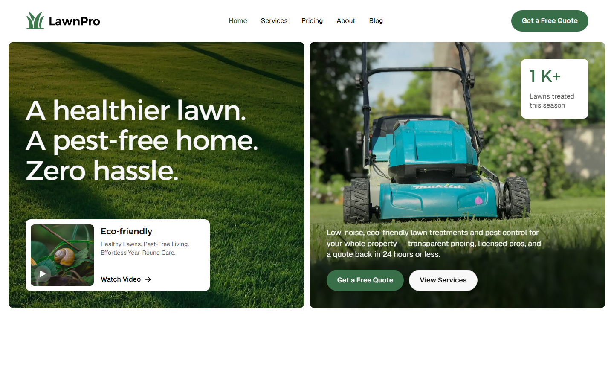

# LawnPro: Lawn Care & Pest Control Astro Theme

A multi-page business theme for lawn care, landscaping and pest control companies, built with [Astro](https://astro.build). Services and blog posts can come from the bundled JSON files or from a [Strapi](https://strapi.io) CMS.



## Features

- 12 pages: Home, Services, Service detail, Pricing, About, Blog, Blog post, FAQ, Book a Service, Privacy Policy, Style Guide, 404
- Services and Blog content collections with typed schemas
- Optional Strapi 5 integration: set one environment variable to switch the content source
- Scroll and text animations (GSAP), sliders, tabs and a mobile menu
- Fully static output that deploys to any host
- SEO meta, Open Graph and Twitter cards on every page, including collection pages

## Quick start

```bash
npm install
npm run dev
```

Open http://localhost:4321.

| Command           | Action                                   |
| ----------------- | ---------------------------------------- |
| `npm run dev`     | Start the dev server                     |
| `npm run build`   | Build the production site to `./dist/`   |
| `npm run preview` | Preview the production build locally     |

## Project structure

```text
public/
  css/  fonts/  images/  js/     Theme styles, fonts, images and runtime scripts
src/
  components/
    cms/                         Collection lists (service cards, post cards…)
    Navbar.astro  Footer.astro
  data/
    services.json  posts.json    Bundled demo content
  layouts/BaseLayout.astro       <head>, SEO meta, navbar, footer, scripts
  lib/
    content.ts                   Content helpers (sorting, URLs, date format)
    strapi.ts                    Strapi loader
  pages/
    service/[slug].astro         Service detail pages
    post/[slug].astro            Blog post pages
    …
  content.config.ts              Collection schemas and data source
```

## Editing content

### Option 1: JSON files (default)

Edit `src/data/services.json` and `src/data/posts.json`. Items are listed by their `order` field. Posts with `"featured": true` appear in the "Featured Post" row on the blog page; the rest fill the grid. Images live in `public/images/cms/`.

### Option 2: Strapi CMS

1. Run a Strapi 5 project with `service` and `post` collection types (a ready-made one with the same fields and the demo content is available alongside this theme).
2. Copy `.env.example` to `.env` and set:

   ```bash
   STRAPI_URL=http://localhost:1337
   STRAPI_TOKEN=            # only if the API isn't public
   ```

3. Run `npm run dev` or `npm run build`. Content is pulled from Strapi at build time.

Because the site is static, set up a Strapi webhook (Settings → Webhooks) that calls your host's build hook, so publishing in Strapi redeploys the site.

## Customizing

- **Site URL**: set `site` in `astro.config.mjs` so canonical URLs and social images use absolute links.
- **Colors and typography**: edit the variables at the top of `public/css/lawnpro-astro-theme.webflow.css`.
- **Navigation and footer**: `src/components/Navbar.astro` and `src/components/Footer.astro`.
- **Social image**: replace `public/images/og-image.webp` (1200×630).

## Animations

Scroll and page animations are Webflow Interactions (GSAP), driven by `public/js/webflow.js` and configured per page through the `wfPage` id each page passes to `BaseLayout`. Keep a page's `wfPage` value when you copy or rename it, or its animations will not run.

`public/js/webflow.js` includes one small patch, marked `LawnPro:`. Webflow's static export bundles every page's interactions into this single file, and without the patch an interaction meant for one page also runs on the others, leaving FAQ cards, badges and blog cards frozen half-faded. The patch registers only the interactions scoped to the current page, which is what Webflow hosting does.

## Forms

The quote form on **Book a Service** is markup only. Connect it to a form backend such as Netlify Forms, Formspree or your own endpoint by setting the form's `action` and `method`.

## License

MIT
